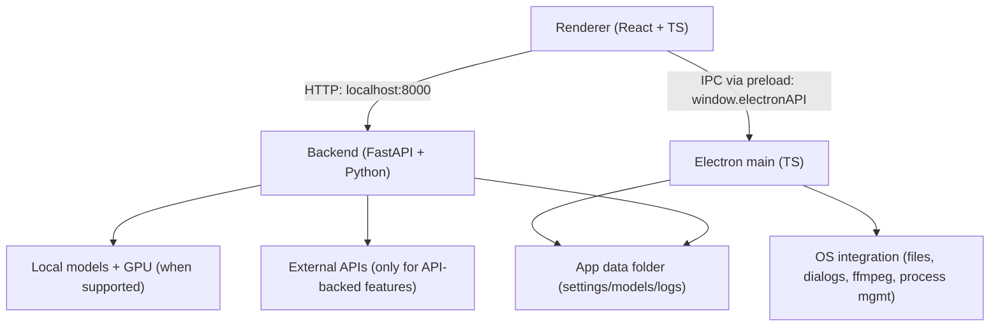

# LTX Desktop — Low VRAM & Extras

A custom fork of [Lightricks/LTX-Desktop](https://github.com/Lightricks/LTX-Desktop) enabling low-VRAM video generation with block swapping, multi-GPU support, LoRA, GGUF, attention tiling, and an extended set of generation and editing features.

> **Status: Beta.** Expect breaking changes.
> Frontend architecture is under active refactor; large UI PRs may be declined for now (see [`CONTRIBUTING.md`](docs/CONTRIBUTING.md)).

<p align="center">
  
</p>

<p align="center">
  
</p>

<p align="center">
  
</p>

## What's different in this fork

This fork extends the upstream LTX-Desktop with low-VRAM support and additional capabilities, targeting consumer GPUs from 8GB VRAM upwards. The reference hardware is a dual NVIDIA RTX 3090 (24GB each, 48GB total).

### VRAM & inference optimisations

| Feature | Description |
| --- | --- |
| **Block swapping** | Keeps only N transformer blocks resident on GPU at a time, swapping the rest to CPU RAM. Configurable via `blockSwapBlocksOnGpu` (0–48). Lowers the VRAM floor from ~31GB to ~8GB. |
| **Attention tiling** | Tiles the query sequence dimension during self-attention to reduce peak VRAM. Configurable via `attentionTileSize`. |
| **VAE tiling** | Tiles the VAE decode step to reduce peak VRAM during video decoding. |
| **FP8 transformer** | Enable FP8 precision for the transformer to reduce VRAM with a minor quality trade-off. |
| **Multi-GPU support** | Splits the text encoder and transformer across two GPUs (`cuda:0` for transformer, `cuda:1` for text encoder) when `useMultiGpu` is enabled and two CUDA devices are present. |
| **GGUF model loading** | Load quantized GGUF model files as an alternative to full-precision SafeTensors, reducing disk and VRAM requirements. |

### Generation controls

| Feature | Description |
| --- | --- |
| **LoRA support** | Load CivitAI-compatible LoRA `.safetensors` files with per-LoRA enable/disable and strength sliders. Multiple LoRAs can be active simultaneously. |
| **Abliterated text encoder** | Optional Gemma-based abliterated encoder for uncensored prompt encoding, toggled via `useAbliteratedEncoder`. |
| **Configurable inference steps** | Choose 1–8 distillation steps per generation (default 4). Fewer steps = faster but lower quality. |
| **STG (Spatio-Temporal Guidance)** | Adjustable STG scale and block index for fine-grained control over motion and structure in generated videos. |
| **Negative prompt** | Describe what to exclude from the generation. Sent as a separate text embedding alongside the positive prompt. |
| **Seed locking** | Lock the seed from the last generation to reproduce identical or near-identical results. The used seed is displayed after each generation. |
| **Pipeline reload interval** | Automatically reload the generation pipeline every N generations to reclaim VRAM from accumulated state. |
| **Extended generation lengths** | 15, 20, and 25 second video generation (361+ frames at 24fps) on supported hardware. |

### Prompt tooling

| Feature | Description |
| --- | --- |
| **Prompt enhancement** | AI-powered prompt rewriting using a local Gemma model. Expands short prompts into detailed, structured generation-ready descriptions. Preserves dialogue and adds motion cues. |
| **Prompt history** | Persists the last 50 prompts in localStorage. Browse and re-use previous prompts from the Playground. |
| **Sidecar metadata** | Each generated video is accompanied by a `.json` sidecar file recording the prompt (original and enhanced), settings, seed, and timestamp. |

### Multi-frame conditioning

| Feature | Description |
| --- | --- |
| **First / middle / last frame** | Upload images to condition the start frame, one or more middle frames, and/or the end frame of generation. Each slot has an independent strength slider. |
| **Frame extraction** | Extract frames directly from existing videos to use as conditioning inputs. |

### Generation queue

| Feature | Description |
| --- | --- |
| **Queue panel** | Add multiple generations to a queue from the Playground. Jobs run sequentially in the background. View status, cancel individual jobs, and see completed results — all without blocking the UI. |

### Video editor extras

| Feature | Description |
| --- | --- |
| **Retake** | Replace a temporal region within an existing clip using full latent-space conditioning — both sides of the cut guide the model, producing natural blending without manual frame stitching. |
| **Gap fill** | Click any gap between timeline clips to generate content (text-to-video, image-to-video, or text-to-image) that fills the exact duration of the gap. Includes AI-suggested prompts based on neighbouring clips. |
| **Negative prompt in gap fill** | Collapsible negative prompt field in the gap generation modal. |

---

## Feature guide

See [`docs/FEATURES.md`](docs/FEATURES.md) for detailed usage instructions for each feature.

## Roadmap

See [`docs/ROADMAP.md`](docs/ROADMAP.md) for planned features and contribution opportunities.

---

## Local vs API mode

| Platform / hardware | Generation mode | Notes |
| --- | --- | --- |
| Windows + CUDA GPU with **≥8GB VRAM** | Local generation (with block swapping) | Downloads model weights locally |
| Windows + CUDA GPU with **≥24GB VRAM** | Local generation (full speed) | Downloads model weights locally |
| Windows (no CUDA or unknown VRAM) | API-only | **LTX API key required** |
| Linux + CUDA GPU with **≥8GB VRAM** | Local generation (with block swapping) | Downloads model weights locally |
| Linux + CUDA GPU with **≥24GB VRAM** | Local generation (full speed) | Downloads model weights locally |
| Linux (no CUDA or unknown VRAM) | API-only | **LTX API key required** |
| macOS (Apple Silicon builds) | API-only | **LTX API key required** |

In API-only mode, available resolutions/durations may be limited to what the API supports.

---

## System requirements

### Windows (local generation)

- Windows 10/11 (x64)
- NVIDIA GPU with CUDA support and **≥8GB VRAM** (block swapping enabled; 24GB+ recommended for full performance)
- 16GB+ RAM (32GB+ recommended when using block swapping — CPU RAM absorbs offloaded blocks)
- **160GB+ free disk space** (for model weights, Python environment, and outputs)

### Linux (local generation)

- Ubuntu 22.04+ or similar distro (x64 or arm64)
- NVIDIA GPU with CUDA support and **≥8GB VRAM** (block swapping enabled; 24GB+ recommended for full performance)
- NVIDIA driver installed (PyTorch bundles the CUDA runtime)
- 16GB+ RAM (32GB+ recommended when using block swapping)
- Plenty of free disk space for model weights and outputs

### macOS (API-only)

- Apple Silicon (arm64)
- macOS 13+ (Ventura)
- Stable internet connection

---

## Low-VRAM configuration

Block swapping and attention tiling are the two main VRAM-saving knobs. Both are configured in **Settings > VRAM**.

| Setting | Type | Range | Description |
| --- | --- | --- | --- |
| `blockSwapBlocksOnGpu` | int | 0–48 | Transformer blocks kept on GPU at once. Lower = less VRAM, slower. 0 disables block swapping. |
| `attentionTileSize` | int | 64–2048 | Query chunk size for tiled attention. Smaller = less peak VRAM during attention. |
| `useVaeTiling` | bool | — | Tile the VAE decode step. Reduces peak VRAM at decode time. |
| `useMultiGpu` | bool | — | Split transformer (cuda:0) and text encoder (cuda:1) across two GPUs. |
| `useFp8Transformer` | bool | — | FP8 precision for the transformer. Reduces VRAM, minor quality trade-off. |
| `ggufTransformerPath` | string | — | Path to a GGUF quantized model (alternative to SafeTensors). |

**Recommended starting config — single 24GB GPU (RTX 3090 / 4090):**
- `blockSwapBlocksOnGpu`: 20–32
- `attentionTileSize`: 256–512
- `useVaeTiling`: true

**Recommended config — dual 24GB GPUs:**
- `useMultiGpu`: true
- `blockSwapBlocksOnGpu`: 0–20
- `attentionTileSize`: 512

**Minimum config — 8GB GPU:**
- `blockSwapBlocksOnGpu`: 4–8
- `attentionTileSize`: 64–128
- `useVaeTiling`: true
- `useFp8Transformer`: true
- Keep resolution at 540p, duration ≤5s

---

## LoRA support

Place CivitAI-compatible `.safetensors` LoRA files in any accessible folder and add them via **Settings > LoRAs**. Each LoRA can be independently enabled/disabled with a strength slider. Multiple LoRAs can be active simultaneously.

The `civitaiLoras` setting holds the list of active LoRA configurations (path, strength, enabled).

---

## GGUF model loading

Set `ggufTransformerPath` in settings to the path of a quantized `.gguf` transformer file. This replaces the default SafeTensors loader and can significantly reduce disk footprint and VRAM usage. Leave blank to use the default full-precision SafeTensors model.

---

## Abliterated text encoder

Set `useAbliteratedEncoder: true` in settings to swap the default text encoder for a Gemma-based abliterated encoder. This removes content filtering from prompt encoding. The encoder is swapped before embeddings are generated; no other part of the pipeline is affected.

---

## Install

1. Download the latest installer from GitHub Releases: [Releases](../../releases)
2. Install and launch **LTX Desktop**
3. Complete first-run setup

---

## First run & data locations

LTX Desktop stores app data (settings, models, logs) in:

- **Windows:** `%LOCALAPPDATA%\LTXDesktop\`
- **macOS:** `~/Library/Application Support/LTXDesktop/`
- **Linux:** `$XDG_DATA_HOME/LTXDesktop/` (default: `~/.local/share/LTXDesktop/`)

Model weights are downloaded into the `models/` subfolder (this can be large and may take time).

On first launch you may be prompted to review/accept model license terms (license text is fetched from Hugging Face; requires internet).

Text encoding: to generate videos you must configure text encoding:

- **LTX API key** (cloud text encoding) — **FREE** and highly recommended to speed up inference and save memory. Generate a free API key at the [LTX Console](https://console.ltx.video/).
- **Local Text Encoder** (extra download; enables fully-local operation on supported Windows hardware).

---

## API keys, cost, and privacy

### LTX API key

The LTX API is used for:

- **Cloud text encoding and prompt enhancement** — **FREE**; highly recommended
- API-based video generations (required on macOS and unsupported hardware) — paid
- Retake — paid

An LTX API key is required in API-only mode, but optional on Windows/Linux local mode if you enable the Local Text Encoder.

Generate a FREE API key at the [LTX Console](https://console.ltx.video/).

When you use API-backed features, prompts and media inputs are sent to the API service. Your API key is stored locally in your app data folder — treat it like a secret.

### fal API key (optional)

Used for Z Image Turbo text-to-image generation in API mode. Create an API key in the [fal dashboard](https://fal.ai/dashboard/keys).

### Gemini API key (optional)

Used for AI prompt suggestions in the video editor gap fill. When enabled, prompt context and frames may be sent to Google Gemini.

---

## Architecture

LTX Desktop is split into three main layers:

- **Renderer (`frontend/`)**: TypeScript + React UI.
  - Calls the local backend over HTTP at `http://localhost:8000`.
  - Talks to Electron via the preload bridge (`window.electronAPI`).
- **Electron (`electron/`)**: TypeScript main process + preload.
  - Owns app lifecycle and OS integration (file dialogs, native export via ffmpeg, starting/managing the Python backend).
  - Security: renderer is sandboxed (`contextIsolation: true`, `nodeIntegration: false`).
- **Backend (`backend/`)**: Python + FastAPI local server.
  - Orchestrates generation, model downloads, and GPU execution.
  - Calls external APIs only when API-backed features are used.

### Fork-specific backend services

| Service | File | Description |
| --- | --- | --- |
| `BlockSwapService` | `backend/services/block_swap_service.py` | Patches transformer block `forward()` methods to swap blocks on/off GPU in a sliding window during inference. |
| `AttentionTileService` | `backend/services/attention_tile_service.py` | Globally patches `F.scaled_dot_product_attention` to process queries in tiles. |
| `LoraService` | `backend/services/lora_service.py` | Loads and merges CivitAI LoRA weights into the transformer. |
| `GGUFLoaderService` | `backend/services/gguf_loader_service.py` | Replaces the default SafeTensors loader with a GGUF-compatible loader. |
| `AbliterationService` | `backend/services/abliteration_service.py` | Swaps in a Gemma-based abliterated text encoder before embedding generation. |



---

## Development (quickstart)

Prereqs:

- Node.js
- `uv` (Python package manager)
- Python 3.12+
- Git

Setup:

```bash
pnpm setup:dev
```

Run:

```bash
pnpm dev
```

Debug:

```bash
pnpm dev:debug
```

`dev:debug` starts Electron with inspector enabled and starts the Python backend with `debugpy`.

Typecheck:

```bash
pnpm typecheck
```

Backend tests:

```bash
pnpm backend:test
```

Building installers:
- See [`INSTALLER.md`](docs/INSTALLER.md)

---

## Telemetry

LTX Desktop collects minimal, anonymous usage analytics (app version, platform, and a random installation ID) to help prioritise development. No personal information or generated content is collected. Analytics is enabled by default and can be disabled in **Settings > General > Anonymous Analytics**. See [`TELEMETRY.md`](docs/TELEMETRY.md) for details.

---

## Docs

- [`docs/FEATURES.md`](docs/FEATURES.md) — detailed feature usage guide
- [`docs/ROADMAP.md`](docs/ROADMAP.md) — planned features and contribution opportunities
- [`docs/INSTALLER.md`](docs/INSTALLER.md) — building installers
- [`docs/TELEMETRY.md`](docs/TELEMETRY.md) — telemetry and privacy
- [`backend/architecture.md`](backend/architecture.md) — backend architecture

---

## Contributing

See [`CONTRIBUTING.md`](docs/CONTRIBUTING.md).

---

## License

Apache-2.0 — see [`LICENSE.txt`](LICENSE.txt).

Third-party notices (including model licenses/terms): [`NOTICES.md`](NOTICES.md).

Model weights are downloaded separately and may be governed by additional licenses/terms.
